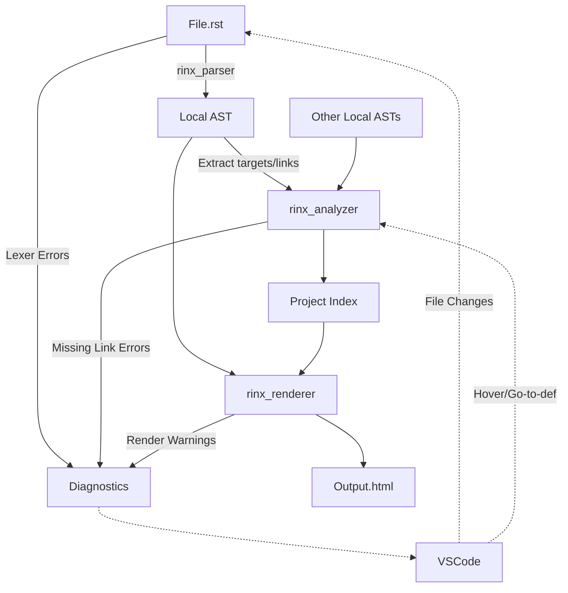

# Rinx: Architecture & Design Principles

This document outlines the core architecture and key principles for `rinx`, a high-performance, resilient, and Bazel-friendly re-implementation of the Sphinx documentation framework in Rust.

---

## 1. Key Principles

1. **Performance-First**: Leverage Rust's zero-cost abstractions, efficient memory management (e.g., string interning or zero-copy parsing), and optimized data structures.
2. **Deterministic and Modular**: To be truly Bazel-friendly, the generation process must be deterministic and split into granular, cacheable steps with explicit inputs and outputs.
3. **Resilience and Error-Recovery**: For LSP and live-preview support, the parser must be fault-tolerant. Syntax errors should not abort the process; instead, they should produce "Error Nodes" in the Abstract Syntax Tree (AST), allowing the rest of the document to be parsed and rendered.
4. **Library-First Design**: The core logic must be an API-agnostic rust library (`rinx_core`). The Bazel worker and LSP are simply frontends wrapping this core.

---

## 2. High-Level Architecture

The system is divided into several crates/modules to ensure a clean separation of concerns:

- `rinx_parser`: Handles lexing and parsing of reStructuredText (RST) into an AST.
- `rinx_ast`: Defines the AST nodes, types, and representation.
- `rinx_analyzer`: Manages cross-references, indexing, TOC generation, and project-wide analysis.
- `rinx_renderer`: Converts the resolved AST into the final output formats (HTML).
- `rinx_worker`: A unified binary capable of acting as a **Bazel Persistent Worker**. Instead of spawning thousands of short-lived separate processes (`parse`, `index`, `render`), Bazel runs a single persistent background process. This allows `rinx` to drastically cut OS process startup times and reuse memory allocations (e.g., string interning pools) across sequential parse actions, achieving massive performance gains.
- `rinx_lsp`: The Language Server implementing the LSP protocol for editor integration.

---

## 3. Addressing the Core Requirements

### 3.1. Fast HTML Generation
- **Parallelism Management**: Parsing and rendering individual files is embarrassingly parallel. 
  - **In a Bazel context**: Parallelism is handled entirely by Bazel spawning multiple `rinx-worker` processes. There is no standalone multi-threaded build orchestrator.
  - **In an LSP context**: `rayon` can be used to drastically speed up the initial workspace indexing of all `.rst` files.
- **Zero-copy/Arena Allocation**: By using bump allocators (e.g., `bumpalo`) or lifetimes tied to the input source file, AST generation can avoid excessive heap allocations, making it blazingly fast.

### 3.2. Bazel Compatibility (Maximized Caching)
To maximize Bazel\'s caching capabilities, the compilation pipeline must be broken down into discrete phases. A traditional Sphinx build is highly stateful; `rinx` will use a **Multi-Phase Compilation Model**:

1. **Phase 1: Parse (1:1 Cacheable)**
   - **Input**: `page.rst`
   - **Output**: `page.ast` (A serialized binary or robust JSON representation of the local AST and local reference requirements).
   - *Bazel Benefit*: If one file changes, only that file is re-parsed.
2. **Phase 2: Indexing / Link Resolution (N:1)**
   - **Input**: All `*.ast` files.
   - **Output**: `project.index` (A global symbol table containing targets, TOC trees, and cross-reference maps).
   - *Bazel Benefit*: This step evaluates project-wide state but avoids re-parsing text.
3. **Phase 3: Render (1:1 Cacheable)**
   - **Input**: `page.ast` + `project.index`
   - **Output**: `page.html`
   - *Bazel Benefit*: Each compilation to HTML only depends on its own AST and the global index. If `A.rst` changes, `B.html` may only need re-rendering if the global index changed in a way that affects `B`.

### 3.3. Live Preview & Fault Tolerance (VSCode)
To support a live preview that renders even when the document is incomplete or contains errors:
- **Error-Resilient Parser**: The parser should implement recovery strategies. If a directive is malformed, the parser captures the malformed text as an `ErrorNode` or `RawTextNode` and continues parsing the subsequent blocks.
- **Incremental Rendering**: In a live preview, `rinx` can skip the global indexing phase or use a stale index, simply converting the in-memory AST directly into HTML on every keystroke. This guarantees a sub-millisecond turn-around for visual updates.

### 3.4. Language Server (LSP) Derivation
A traditional compiler drops state after finishing. An LSP needs to maintain state and perform incremental updates. 
- **Query-Based Architecture**: Consider using a query-based compiler framework like **`salsa`** (used by `rust-analyzer`).
- This allows the core library to cache intermediate results (like \"get AST for file\", \"get resolved links\"). When the user edits a file in VSCode, only the queries dependent on that file\'s text are invalidated and recomputed.
- **Diagnostics**: Instead of using `Result<T, E>` to short-circuit upon finding an error, functions will return `(Output, Vec<Diagnostic>)`. This ensures that the LSP can underline multiple errors in a document without halting analysis at the first mistake.

---

## 4. Recommended Data Flow



## 4.5. Bazel Rule Design (Library & Site Pattern)

To natively support Massive Monorepo codebases where decentralized teams manage isolated documentation, `rinx` relies strictly on a **Library & Site Pattern**, powered by Bazel's Action Graph and Providers. 

This mirrors idiomatic targets like `cc_library` / `cc_binary`.

### Usage Example

**1. Decentralized Libraries (`rinx_library`)**
Teams maintain their own `.rst` documentation in subfolders using `rinx_library`. This rule parses localized documentation into `.ast` files. Crucially, the `deps` attribute is **strictly reserved for Toctree hierarchies and transclusion**. It is *not* used for standard cross-references/hyperlinks.

```starlark
# //team_a/BUILD.bazel
load("@rinx//:defs.bzl", "rinx_library")

rinx_library(
    name = "docs",
    srcs = glob(["**/*.rst"]),
    deps = ["//team_b/shared:docs"], # ONLY required if team_a has `.. toctree:: team_b`
)
```

**2. Centralized Site Assembler (`rinx_site`)**
To build the complete global project documentation, a top-level rule collects all the localized libraries to generate a unified, cross-referenced web portal. 

```starlark
# //docs_portal/BUILD.bazel
load("@rinx//:defs.bzl", "rinx_site")

rinx_site(
    name = "enterprise_docs",
    deps = [
        "//team_a:docs",
        "//team_b:docs",
    ],
)
```

### The Hybrid Dependency Model

To ensure site integrity while maintaining developer flexibility in a monorepo, `rinx` uses a two-pronged dependency approach:

- **Strict Toctree Dependencies (`deps`)**: `rinx_library` targets require explicit `deps` declarations for any external documents they include in a `.. toctree::`. Because Bazel strictly enforces a Directed Acyclic Graph (DAG) for `deps`, this naturally prevents infinite loops in navigation/table of contents across the entire codebase. It also provides the "Transitive Discovery" backbone so a top-level site can simply depend on the root document.
- **Late Resolution (Free-Linking)**: Standard cross-references (hyperlinks) within text are *not* required in Bazel `deps`. They are stored as symbolic string markers in the Phase 1 AST. These links are resolved globally during Phase 2 Indexing at the `rinx_site` level. This allows authors to freely link documents cyclically (Doc A links to Doc B, and Doc B links to Doc A) without triggering Bazel "cycle in dependency graph" errors.
- **Site-Namespaced Rendering**: Because HTML content is a product of both the local AST and the global site index, HTML artifacts are owned by the `site`, not the `library`. Generated HTML files are namespaced under a site-specific directory to prevent Bazel Action Conflict errors when multiple site targets consume the same library.

### Implications for the Rule Implementations

This strict separation requires the Starlark implementation to map the **Multi-Phase Compilation Model** across the Bazel target dependency graph:

1. **Phase 1 Actions (`rinx_library`)**:
   For every `.rst` file in `srcs`, the local library rule declares an action running the worker in `parse` mode.
   - **Outputs**: `page.ast`
   The rule returns a `RinxInfo` provider containing its generated `.ast` files.

2. **Phase 2 & 3 Actions (`rinx_site`)**:
   The site assembler rule extracts the `RinxInfo` provider from all its `deps` to collect *every single transitively compiled `.ast` file* across the entire monorepo.
   
   - **Phase 2 (Index Action)**: It declares exactly one action running the worker in `index` mode, passing the full collection of localized `.ast` files.
     - **Output**: A unified `project.index`.
   
   - **Phase 3 (Render Actions)**: It declares an action running the worker in `render` mode for every individual `.ast` file.
     - **Inputs**: `page.ast` and the unified global `project.index`.
     - **Outputs**: `[site_name]_site_out/page.html` (Strictly namespaced into the site's directory to prevent collisions)

**Why this scales infinitely:** If a developer in `team_a` fixes a typo, Bazel only reruns Phase 1 for that single file. `team_b`'s `.ast` files are fully cached. Because Bazel tracks the inputs to Phase 2 and Phase 3 natively, the global index is quickly rebuilt, and then Bazel only triggers Phase 3 for the HTML pages strictly impacted by the modifications. The Rust binary never needs to "know" about monorepos; Bazel orchestrates caching effortlessly.

## 5. Next Steps for Implementation
1. **Repository Setup**: Initialize a Cargo workspace with the core crates (`ast`, `parser`, `analyzer`, `renderer`, `worker`, `lsp`).
2. **Prototyping the AST**: Define the data structure for the AST that can handle both valid RST elements and represent syntax errors organically.
3. **Drafting the Parser**: Build a basic lexer/parser pipeline capable of parsing a subset of RST (e.g., headings, paragraphs, bold/italics) and successfully outputting an `ErrorNode` for invalid syntax without panicking.
4. **Bazel Rules Draft**: Create a simple `BUILD.bazel` to test the phase 1 (parse) -> phase 2 (index) -> phase 3 (render) workflow.
